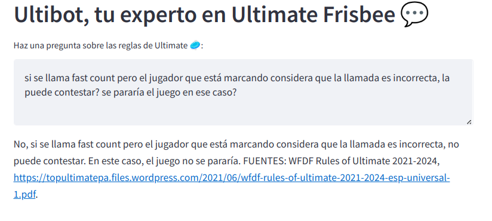

# Ultibot

Ultimate Frisbee Chatbot, made with langchain and the GPT LLM, using Pinecone as the Vector storage.

Supported languages: English and Spanish.

## Screenshots

### Example 1: Question about the pick call

### Example 2: Question about a fast count call

## Set-up

### Backend setup

Create a new virtual environment and activate it:

    python -m venv env/
    source env/bin/activate

Install the needed dependencies:

    pip install -r requirements.txt

Copy the `.env-default` file to `.env` file and fill it with your API keys:

    cd src/
    cp .env-default .env

### Ingesting the Ultimate Frisbee official rules knowledge

Ingest the Ultimate Frisbee documentation from the official rules PDF:

    python src/ingest.py

### Starting the server

For starting the Streamlit Server, run the following command:

    streamlit run src/main.py

A new page in your browser will be opened pointing to the server