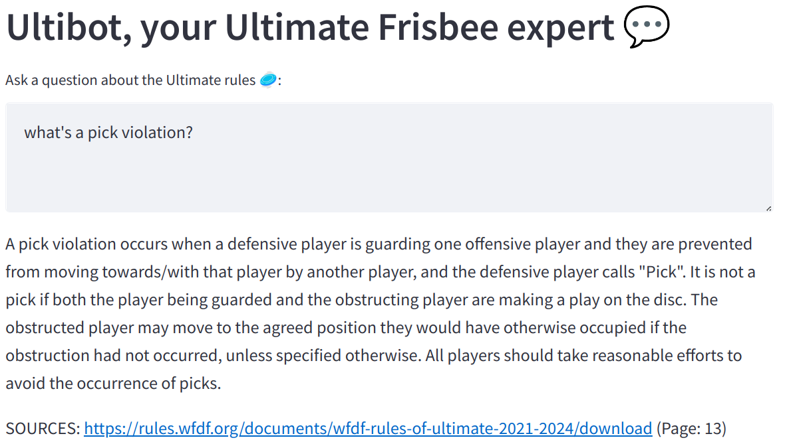
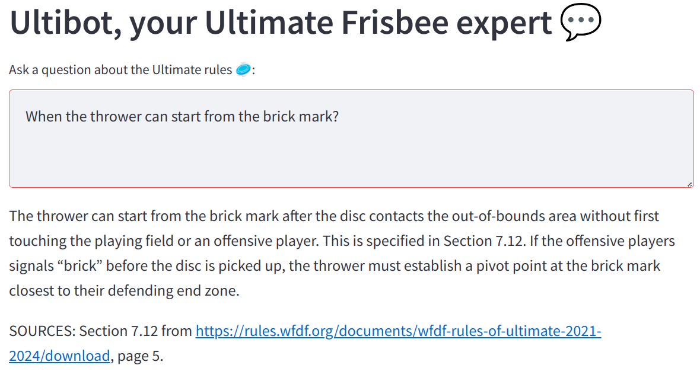

# Ultibot

Ultimate Frisbee Chatbot, made with langchain and the GPT LLM, using Pinecone as the Vector storage.

Supported languages: English and Spanish.

## Screenshots

### Example 1: Question about the pick call

### Example 2: Question about the brick mark

## Set-up

### Backend setup

Create a new virtual environment and activate it:

    python -m venv env/
    source env/bin/activate

Install the needed dependencies:

    pip install -r requirements.txt

Copy the `.env-default` file to `.env` file and fill it with your API keys:

    cp .env-default .env

You need to have API keys both from [OpenAI](https://platform.openai.com/account/api-keys) for running the Q/A UI, and from [Pinecone](https://app.pinecone.io) for storing the knowledge base.

### Ingesting the Ultimate Frisbee official rules knowledge

Ingest the Ultimate Frisbee documentation from the official rules PDF:

    python ingest.py

### Starting the server

For starting the Streamlit Server, run the following command:

    streamlit run main.py

A new page in your browser will be opened pointing to the server